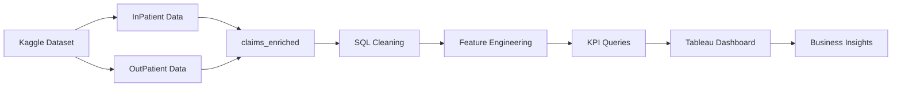

# Healthcare-Fraud-Detection-Analytics
This solution demonstrates how healthcare claims data can be transformed into actionable business insights. By combining SQL-based data engineering with interactive Tableau visualizations, decision-makers can monitor reimbursement patterns, identify high-cost providers, and support operational efficiency through data-driven decisions.

                      SQL + BigQuery + Tableau Dashboard

#Project Overview

Healthcare organizations process millions of insurance claims every year. Monitoring reimbursement patterns, provider activity, and claim characteristics is essential to detect unusual behaviors and support fraud investigations.

This project demonstrates how SQL and Tableau can be combined to transform raw healthcare claims into an interactive executive dashboard for business decision-making.

The project covers the complete analytics workflow:

Data integration
Data cleaning
Feature engineering
KPI design
Interactive dashboard development
Business storytelling
Business Problem

Healthcare insurers need visibility into:

How many claims are processed?
Which providers receive the highest reimbursements?
Are inpatient claims significantly more expensive?
How long do inpatient claims remain open?
Where should fraud investigators focus first?

This dashboard answers these questions through interactive visual analytics.

#Dataset

Source: Healthcare Provider Fraud Detection Analysis (Kaggle: https://www.kaggle.com/datasets/rohitrox/healthcare-provider-fraud-detection-analysis)

For this portfolio project, the Test dataset was intentionally selected to simulate a realistic production scenario where unseen data is analyzed instead of training data.

Main tables:

InPatient Data
OutPatient Data

Total records:

135,392 claims

Tech Stack
SQL (Google BigQuery)
Tableau Desktop
Tableau Public
Kaggle Dataset
Data Visualization
Business Intelligence
Data Pipeline

#SQL Workflow

The SQL process included:
✔ Data integration
✔ Data type standardization
✔ Null handling
✔ Safe casting
✔ Feature engineering
✔ Business KPI generation

Main engineered features:

Claim Type
Claim Year
Claim Duration
KPIs

The dashboard includes five executive KPIs:

KPI	Value
Total Claims	135,392
Total Reimbursement	$132.9M
Total Providers	1,353
Total Beneficiaries	63,968
Average Hospital Stay	5.72 Days

#Dashboard

Interactive Tableau dashboard including:

Claims by Type
Reimbursement by Claim Type
Top 10 Providers
Average Claim Amount
Average Hospital Stay

Interactive filters:

Claim Year
Claim Type
Provider

#Key Insights

1. Outpatient claims dominate the dataset

More than 92% of claims correspond to outpatient services.

2. Inpatient claims represent the largest financial burden

Although inpatient claims represent a small percentage of total claims, they account for most reimbursement expenses.

3. Provider concentration

A relatively small group of providers receives a disproportionately high reimbursement amount, suggesting candidates for further fraud investigation.

4. Hospital stays

Average inpatient stay: 5.72 days

5. Executive decision support

The dashboard allows analysts to quickly identify high-cost providers and reimbursement patterns that deserve further review.

#Business Impact
This solution demonstrates how healthcare claims data can be transformed into actionable business insights. By combining SQL-based data engineering with interactive Tableau visualizations, decision-makers can monitor reimbursement patterns, identify high-cost providers, prioritize fraud investigations, and support operational efficiency through data-driven decisions.
